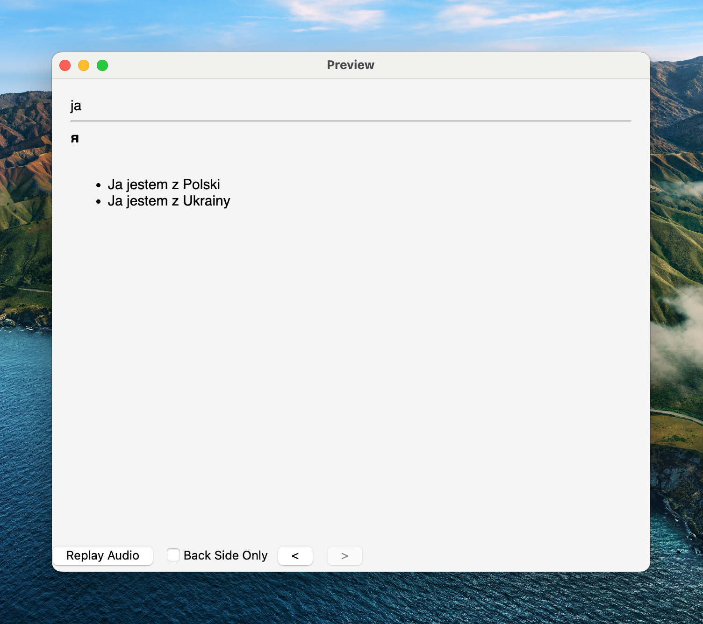

# Anki PL-UA Deck

Source code for generating Anki deck for learning Polish for Ukrainian speakers.



## Installation

```bash
# Create and activate virtual environment
python3 -m venv venv
source venv/bin/activate

# Install dependencies
pip install -r requirements.txt
```

## Generate deck

```bash
python main.py
```

## Add new words

Update `notes.json` file with new words and run `python main.py` again.

## TODO

- [ ] Add more words
- [ ] Add CI/CD for autopublishing deck
- [ ] Add audio for examples

# Anki PL-UA Deck

Код для генерації набору флеш-карток для вивчення польської мови для українців.

## Встановлення

```bash
# Свторюємо та активуємо віртуальне середовище
python3 -m venv venv
source venv/bin/activate

# Встановлюємо залежності
pip install -r requirements.txt
```

## Генерація набору флеш-карток

```bash
python main.py
```

## Додавання нових слів

Оновіть файл `notes.json` новими словами та запустіть `python main.py` знову.
